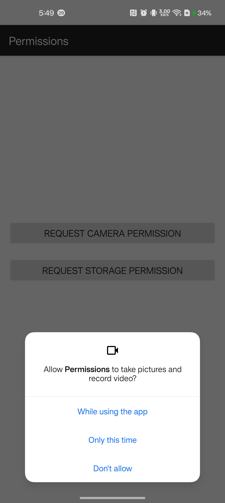
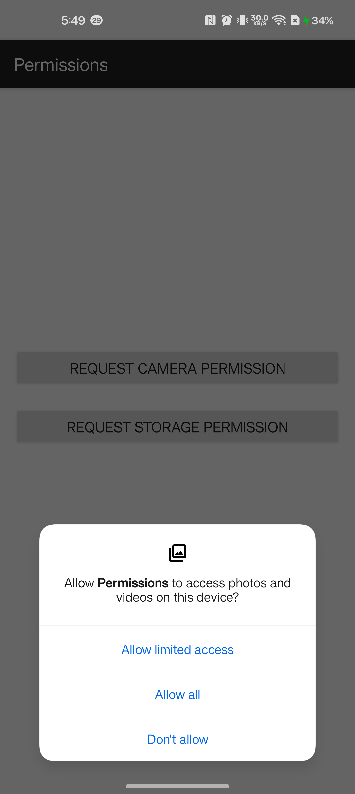

# Ex.No:6 Create a simple application to request storage and camera permission at RunTime using android studio.


## AIM:

To develop a simple application for RunTime Permission in Android Studio.

## EQUIPMENTS REQUIRED:

Android Studio(Min.required Giraffe)

## ALGORITHM:

Step 1: Open Android Stdio and then click on File -> New -> New project.

Step 2: Then type the Application name as runtimepermission and click Next. 

Step 3: Then select the Minimum SDK as shown below and click Next.

Step 4: Then select the Empty Activity and click Next. Finally click Finish.

Step 5: Design layout in activity_main.xml.

Step 6: Display process of runtimepermission in android mobile devices.

Step 7: Save and run the application.

## PROGRAM:
```
/*
Program to print the process of runtimepermission in android mobile devices”.
Developed by: R K JAYA KRISNAA
Registeration Number : 212223223002
*/
```
## MainActivity : 
```JAVA
package com.example.permissions;

import android.Manifest;
import android.content.pm.PackageManager;
import android.os.Build;
import android.os.Bundle;
import android.view.View;
import android.widget.Button;
import android.widget.Toast;
import androidx.annotation.NonNull;
import androidx.appcompat.app.AppCompatActivity;
import androidx.core.app.ActivityCompat;
import androidx.core.content.ContextCompat;

public class MainActivity extends AppCompatActivity {

    private Button btnCamera, btnStorage;

    // Define integer codes to identify our permission requests
    private static final int CAMERA_PERMISSION_CODE = 100;
    private static final int STORAGE_PERMISSION_CODE = 101;

    @Override
    protected void onCreate(Bundle savedInstanceState) {
        super.onCreate(savedInstanceState);
        setContentView(R.layout.activity_main);

        btnCamera = findViewById(R.id.btn_camera);
        btnStorage = findViewById(R.id.btn_storage);

        // Set click listener for Camera button
        btnCamera.setOnClickListener(new View.OnClickListener() {
            @Override
            public void onClick(View v) {
                checkPermission(Manifest.permission.CAMERA, CAMERA_PERMISSION_CODE);
            }
        });

        // Set click listener for Storage button
        btnStorage.setOnClickListener(new View.OnClickListener() {
            @Override
            public void onClick(View v) {
                // Check if the device is running Android 13 (Tiramisu) or higher
                if (Build.VERSION.SDK_INT >= Build.VERSION_CODES.TIRAMISU) {
                    // Request the new granular permission (e.g., for images)
                    checkPermission(Manifest.permission.READ_MEDIA_IMAGES, STORAGE_PERMISSION_CODE);
                } else {
                    // Request the old storage permission for Android 12 and below
                    checkPermission(Manifest.permission.READ_EXTERNAL_STORAGE, STORAGE_PERMISSION_CODE);
                }
            }
        });
    }

    // Generic method to check and request permission
    public void checkPermission(String permission, int requestCode) {
        // Checking if permission is not granted
        if (ContextCompat.checkSelfPermission(MainActivity.this, permission) == PackageManager.PERMISSION_DENIED) {
            // Requesting the permission
            ActivityCompat.requestPermissions(MainActivity.this, new String[] { permission }, requestCode);
        } else {
            Toast.makeText(MainActivity.this, "Permission already granted", Toast.LENGTH_SHORT).show();
        }
    }

    // This method is called when the user clicks Allow or Deny in the permission dialog
    @Override
    public void onRequestPermissionsResult(int requestCode, @NonNull String[] permissions, @NonNull int[] grantResults) {
        super.onRequestPermissionsResult(requestCode, permissions, grantResults);

        if (requestCode == CAMERA_PERMISSION_CODE) {
            // Check if the result array is not empty and the user granted the permission
            if (grantResults.length > 0 && grantResults[0] == PackageManager.PERMISSION_GRANTED) {
                Toast.makeText(MainActivity.this, "Camera Permission Granted", Toast.LENGTH_SHORT).show();
            } else {
                Toast.makeText(MainActivity.this, "Camera Permission Denied", Toast.LENGTH_SHORT).show();
            }
        }
        else if (requestCode == STORAGE_PERMISSION_CODE) {
            if (grantResults.length > 0 && grantResults[0] == PackageManager.PERMISSION_GRANTED) {
                Toast.makeText(MainActivity.this, "Storage Permission Granted", Toast.LENGTH_SHORT).show();
            } else {
                Toast.makeText(MainActivity.this, "Storage Permission Denied", Toast.LENGTH_SHORT).show();
            }
        }
    }
}
```
## AndroidManifest :
```XML
package="com.example.permissionapp"> <uses-permission android:name="android.permission.CAMERA" />
    <uses-permission android:name="android.permission.READ_EXTERNAL_STORAGE" android:maxSdkVersion="32" />
    <uses-permission android:name="android.permission.WRITE_EXTERNAL_STORAGE" android:maxSdkVersion="32" />

    <uses-permission android:name="android.permission.READ_MEDIA_IMAGES" />
    <uses-permission android:name="android.permission.READ_MEDIA_VIDEO" />
    <uses-permission android:name="android.permission.READ_MEDIA_AUDIO" />
```
## activity_main : 
```XML
<?xml version="1.0" encoding="utf-8"?>
<LinearLayout xmlns:android="http://schemas.android.com/apk/res/android"
    android:layout_width="match_parent"
    android:layout_height="match_parent"
    android:orientation="vertical"
    android:gravity="center"
    android:padding="16dp">

    <Button
        android:id="@+id/btn_camera"
        android:layout_width="match_parent"
        android:layout_height="wrap_content"
        android:text="Request Camera Permission"
        android:layout_marginBottom="20dp"
        android:textSize="18sp"/>

    <Button
        android:id="@+id/btn_storage"
        android:layout_width="match_parent"
        android:layout_height="wrap_content"
        android:text="Request Storage Permission"
        android:textSize="18sp"/>

</LinearLayout>
```
## OUTPUT
### camera permission :


### storage permission :


## RESULT
Thus a Simple Android Application to request storage and camera permission at RunTime in Android Studio is developed and executed successfully.
